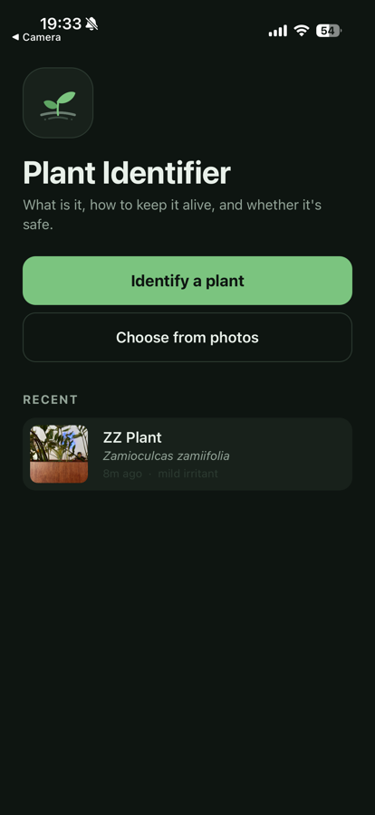
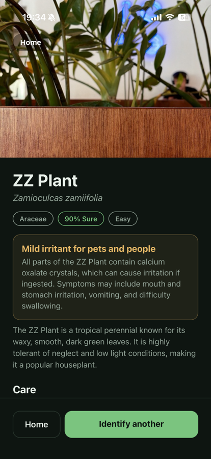
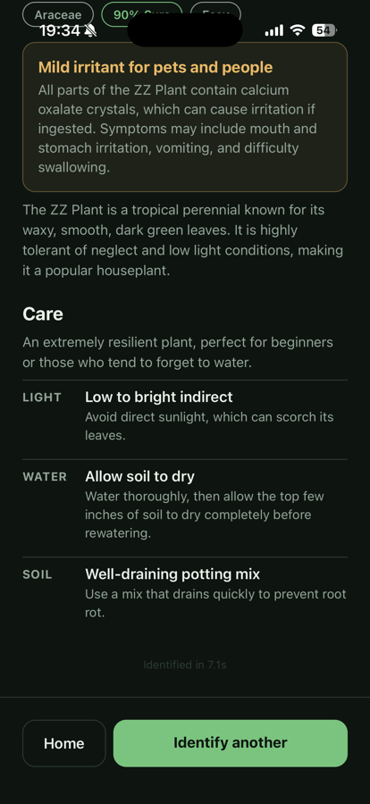

# Plant Identifier

Point a camera at a plant, get back what it is, how to keep it alive, and whether it
will hurt your cat.

This repository is a case study in two parts: a working mobile application built around
that core loop, and three advertising concepts for it. Every number below was measured
against the live API, not estimated.

## Status

| Part | State |
|---|---|
| Identification engine (`shared/`) | Working, verified against the live API |
| Parsing and error contract | Working, 8 tests |
| Mobile app (`app/`) | Working on device: camera, gallery, history |
| Ad concepts (`AD_CONCEPTS.md`) | Three films written |

## Screenshots

| Home | Result | Care |
|---|---|---|
|  |  |  |

The graded toxicity verdict sits above the care advice, because it is the fact people act
on. "Mild irritant" is amber rather than red: the plant is not dangerous, but chewing it
causes irritation, and collapsing those two into one red warning is how a safety feature
stops being believed. The recent list uses the same wording, so the two screens cannot
contradict each other.

Every care fact is a short label with one sentence underneath. An earlier version of this
card rendered 1,323 characters of prose; it is 718 now, and the three labels the eye lands
on first total 66.

## Measured results

`gemini-2-5-flash` via EachLabs, `thinking_budget=0`, 26 KB JPEG:

| | Model time | End to end | Cost |
|---|---|---|---|
| Plant photo | 2.96 – 3.39 s | 5.24 – 6.27 s | $0.00128 |
| Non-plant photo | 1.11 – 2.38 s | 3.54 – 5.68 s | $0.00051 |

End to end covers upload, prediction and polling. About **780 identifications per dollar**.

The identification is correct: a photo of forget-me-nots returns *Myosotis sylvatica*,
family Boraginaceae, 95% confidence, correctly reported as non-toxic to cats, dogs and
humans, with *Cynoglossum amabile* and *Omphalodes verna* offered as runners-up. A
screenshot returns `is_plant: false` rather than an invented species.

### What the result card taught us

The first version of the card rendered 1,323 characters of prose. `care.light` alone came
back as a 214-character paragraph where the answer was "partial shade". Splitting every care
fact into a short label plus one sentence of detail, and putting explicit word limits in the
prompt, cut the card to 718 characters. The three labels the eye lands on first total 66.

The same pass exposed a real defect. Toxicity was a pair of booleans, and the verdict for
forget-me-nots flipped between "non-toxic to cats, dogs and humans" and "mildly toxic" when
the prompt changed - three consecutive runs each way, so this was the prompt talking, not
sampling noise. Neither answer was wrong. The plant is not dangerous, but eating a quantity
of it upsets a stomach, and a boolean forced "kills cats" and "upsets stomachs" into the same
box. Replacing it with a severity scale of none / mild / serious made the answer both stable
and accurate: `severity: "mild"`, `toxic_to_pets: true`.

The lesson generalises: when a model's answer keeps flipping, the field may be asking a
question that has no honest binary answer.

### Why this model

The same photo was sent to four models. All four identified the species correctly. Only
`gemini-2-5-flash` supports `response_schema`, so only it returns JSON guaranteed to match
the application's type. The router models wrapped their answers in a markdown code fence,
which on a phone means a string-cleaning hack and a screen that crashes on the day the
model changes its formatting.

The parser still handles a fenced answer, but records it in `metrics.outputRepaired`. If
that flag ever turns true in production, the claim above is wrong and we will know.

### Why reasoning is disabled

`thinking_budget` was measured, not assumed:

| | Model time | Cost | Answer |
|---|---|---|---|
| `0` (chosen) | 2.96 s | $0.00144 | *Myosotis sylvatica*, 95% |
| `-1` | 9.82 s | $0.00486 | *Myosotis scorpioides*, 98% |

Reasoning is 3.3x slower and 3.4x more expensive, and it changed the species while staying
in the same genus. Both answers are plausible forget-me-nots; the photograph does not
contain enough evidence to separate them. That is the real finding: the model is reliable
at genus and uncertain at species, which is why the result carries a calibrated
`confidence` and a list of `alternatives` instead of a single confident-looking name.

## Architecture

```
shared/types.ts      The contract: PlantResult, IdentifyError, UiState
shared/eachlabs.ts   presign -> S3 upload -> prediction -> poll
scripts/identify.ts  Runs the whole flow from Node, no phone involved
tests/               Parser tests over real captured API responses
app/                 Expo app: home, camera, loading, result
```

The app is five states in one screen, driven by a reducer over `UiState`. Home is the
resting state; the camera is somewhere you go rather than where the app dumps you.
Past identifications are kept on the device as a JSON index beside the photos, which
are copied out of the cache directory so the OS cannot purge them out from under the
list. No account, no server, no sync.

Expo SDK 54, not the current 57: Expo Go on the App Store is still 54.0.2, and an SDK
57 project refuses to open in it. The npm `expo` dist-tag does not tell you this; the
App Store listing does.

`shared/` uses no Node built-ins — only `fetch`, and an `AbortController` rather than
`AbortSignal.timeout`, which React Native's older `fetch` does not provide. So the same
file runs unchanged in the Node verification script and on the phone, and would run
unchanged on a server if the key ever needs to move off the device.

There are no npm dependencies. Node 24 executes TypeScript directly, reads `.env` itself,
and ships `fetch`.

## Running it

`SETUP.md` is the step-by-step version, including running it on a phone.

```bash
echo "EACHLABS_API_KEY=..." > .env
npm run identify -- path/to/plant.jpg          # live identification
npm run identify -- photo.jpg --think          # compare with reasoning enabled
npm run identify -- photo.jpg --dump tests/fixtures/plant   # capture a fixture
npm test                                        # parser tests, no network
```

## The API key, and what is missing

The app calls EachLabs directly, so the key ships inside the bundle. `expo export` says so
out loud: `env: export EXPO_PUBLIC_EACHLABS_API_KEY`. Anyone who takes the bundle apart can
extract it and spend the credits.

That is a real weakness, and it is left in on purpose. The brief asks for a mobile
application. A server is a second thing to deploy, with its own account, its own secrets and
its own lifecycle, and it makes the core loop no better for the person holding the phone.
Shipping this to a store would mean fixing it first; shipping a case study does not.

The fix is small, and the code is already shaped for it. Because `shared/eachlabs.ts` avoids
Node built-ins entirely, it runs unchanged on a server. A thin proxy would hold the key and
expose a single `POST /identify` wrapping presign, upload, predict and poll, so the phone
makes one call instead of four. It would rate limit per IP, since a device id supplied by
the client is trivial to forge. Model fallback and a result cache keyed on a hash of the
photo belong there too, rather than on the phone — and changing model would become a line on
the server rather than an app release.

## The API contract

EachLabs does not document the upload endpoint, so this was established by probing it.

```
POST /v1/upload/presign   { "content_type": "image/jpeg" }
  -> { id, presigned_url, public_url, expires_at, required_headers }
PUT  <presigned_url>      with required_headers verbatim
POST /v1/prediction       { model, version, input: { prompt, media_urls, response_schema, ... } }
  -> { predictionID }
GET  /v1/prediction/{id}  -> { status, output, metrics: { predict_time, cost }, urls }
```

Three things that cost time to discover:

1. **The signature covers `x-amz-meta-file-id`.** `X-Amz-SignedHeaders` is
   `host;x-amz-meta-file-id`, so dropping that header produces a 403
   `SignatureDoesNotMatch` on upload that looks like an upload bug and is a signing bug.
   Echo `required_headers` back exactly.
2. **`expires_at` is not the expiry.** It reports a date months away while the URL's real
   lifetime is `X-Amz-Expires=900`, fifteen minutes. Trust the query parameter.
3. **One auth header is enough.** `X-API-Key` works on every endpoint used here; omitting
   it returns 401. `GET /v1/model` is public and returns 200 with no key at all, so it
   cannot be used to test whether a key is valid.

`GET /v1/prediction/{id}` also returns `urls.cancel`, which lets the app abandon a running
prediction if the user backs out of the six-second wait.

## Deliberately out of scope

Left out on purpose, not left unfinished:

- Accounts, sessions, and syncing history between devices
- Watering reminders and push notifications
- A database and self-hosted object storage
- Per-user quotas, and a result cache keyed on the photo hash
- Subscriptions and server-side receipt validation
- Model fallback and prompt versioning
- A "you got it wrong" feedback loop
- Logging, tracing, analytics

Two of these genuinely touch the core loop — model fallback and the result cache — and
both need the server described above before they are worth building.
